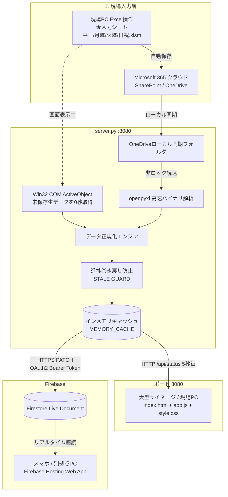

# 倉庫作業進捗サイネージシステム システム仕様書（デスクトップ側最新版）

本書は、物流倉庫内における庫内作業（振出・査照・搬送・伝票照合）の進捗状況をリアルタイムで大型モニターおよび端末画面に可視化する「倉庫作業進捗サイネージシステム」のデスクトップ環境における最新システム仕様書である。

---

## 目次

1. [システム基本情報](#1-システム基本情報)
2. [全体アーキテクチャ & データ連携パイプライン](#2-全体アーキテクチャ--データ連携パイプライン)
3. [デスクトップ側ファイル構成と責務一覧](#3-デスクトップ側ファイル構成と責務一覧)
4. [Excelデータ解析・取得仕様](#4-excelデータ解析取得仕様)
5. [進捗判定ロジック & UI表示マトリクス](#5-進捗判定ロジック--ui表示マトリクス)
6. [フロントエンド制御仕様（UI/UX）](#6-フロントエンド制御仕様uiux)
7. [バックエンドAPI & クラウド連携仕様](#7-バックエンドapi--クラウド連携仕様)
8. [設定仕様（config.json）](#8-設定仕様configjson)
9. [起動・常駐・運用手順](#9-起動常駐運用手順)
10. [障害切り分け・トラブルシューティング](#10-障害切り分けトラブルシューティング)

---

## 1. システム基本情報

* **システム名称**: 倉庫作業進捗サイネージシステム (Warehouse Work Progress Signage System)
* **目的**: 現場PCで日常的に入力されるExcel作業進捗データを自動検知・解析し、倉庫内大型サイネージおよび各端末ブラウザへリアルタイム（1〜2秒間隔）でタイル状に投影。搬送遅延の未然防止および進捗の全体共有を実現する。
* **主要実行環境**:
  * OS: Windows 10 / 11 (64bit)
  * バックエンド: Python 3.14 (同梱の `python_runtime` またはシステムPython)
  * フロントエンド: HTML5 / CSS3 / Vanilla JavaScript（フレームワーク非依存）
  * 通信プロトコル: HTTP (Port 8080) / HTTPS (Google Cloud Firestore REST API)
  * クラウド公開: Firebase Hosting (`https://warehouse-work-progress.web.app`)

---

## 2. 全体アーキテクチャ & データ連携パイプライン

システムは **「現場入力層」「データ収集・解析層」「ローカル表示層」「クラウド配信層」** の4層で自律動作する。



---

## 3. デスクトップ側ファイル構成と責務一覧

デスクトップ側の作業ディレクトリ（`作業進捗状況システム`）は、本番稼働コンポーネント、運用バッチ、クラウド連携機能、および現場診断スクリプト群で構成されている。

### 3.1 コア稼働ファイル

| ファイル名 | 役割・責務 |
| :--- | :--- |
| `server.py` | メインバックエンド。Excel監視、COM/バイナリ読込、STALE GUARD、HTTPサーバー(8080)、Firestore自動中継を担当。 |
| `index.html` | サイネージ画面のDOM構造（ヘッダー時計、曜日タブ、メイン進捗テーブル、設定モーダル）。 |
| `app.js` | フロントエンドロジック。定期APIポーリング、進捗タイル描画、等速スムーズスクロール、時間差計算、一時停止制御。 |
| `style.css` | 視認性を極限まで高めたタイポグラフィ、タイル配色、10分前警告パルス発光アニメーション、レスポンシブスタイル。 |
| `config.json` | 曜日別Excelファイルパス、ポーリング間隔、スクロール速度、フォント倍率などの設定ファイル。 |

### 3.2 起動・停止・常駐バッチ

| ファイル名 | 役割・責務 |
| :--- | :--- |
| `start.bat` | ワンクリック起動バッチ。`python_runtime` またはシステムPythonを判別し、サーバー起動後自動でブラウザを開く。 |
| `サイネージ停止.bat` | サーバー完全停止バッチ。ポート8080リッスンプロセスおよび関連Pythonプロセスを `taskkill /F` で強制終了。 |
| `Windows起動時に自動実行するよう登録.bat` | PC起動（スタートアップ）時に `start.bat` が自動実行されるようショートカットを登録。 |
| `自動実行の登録解除.bat` | スタートアップからの自動起動登録を安全に削除・解除。 |
| `サイネージ閲覧(見るだけ).url` | サーバーを起動せず、すでに起動中のサーバー画面をブラウザで開くためのショートカット。 |

### 3.3 クラウド連携・デプロイ

| ファイル名 | 役割・責務 |
| :--- | :--- |
| `firebase.json` / `.firebaserc` | Firebase Hosting デプロイ設定およびプロジェクト構成ファイル。 |
| `firebase_credentials.json` | Google Cloud サービスアカウント秘密鍵（Firestore API 認証用）。 |
| `deploy_firebase.py` / `.ps1` / `.bat` | フロントエンド静的ファイルを Firebase Hosting へワンライナーでデプロイする自動化スクリプト。 |

### 3.4 調査・診断スクリプト群（デスクトップ開発環境専用）

| ファイル名 | 用途 |
| :--- | :--- |
| `fast_check.py` | 現在アクティブなExcelのパス、シート一覧、およびセルの最新状態を即時ターミナル出力。 |
| `find_excel_source.py` | OneDrive・X:ドライブ内のすべての進捗管理Excelを高速探索・更新日時順にリスト化。 |
| `test_formula_exact.py` | openpyxl で数式計算値（`data_only=True`）が正確に読めているかをテスト。 |
| `diagnose_excel_mtime.py` | OneDriveローカルキャッシュのタイムスタンプ更新遅延を診断。 |

---

## 4. Excelデータ解析・取得仕様

### 4.1 参照対象Excelファイル優先順位
サーバー起動時、`config.json` に定義されたパスおよび以下の優先順位でファイルパスを動的に自動解決する。

1. **★入力シート優先**: OneDrive上の `Shortcuts\新体制移行の情報共有 - ★入力シート\(曜日)（本番用）\(曜日)作業進捗管理データ.xlsm`
2. **ローカルOneDriveキャッシュ**: 実行ユーザー固有の `OneDrive - トヨタモビリティパーツ株式会社` パス
3. **共有フォルダ（X:ドライブ）**: `X:\全社共有\371神奈川\全社ﾌｫﾙﾀﾞ\物流本部フォルダ\00_共有スペース\庫内ステータス管理`

### 4.2 シート構造と列マッピング完全表
各Excelブック内の **「(曜日)データ」** シートおよび **「(曜日)表示」** シートを参照する。
1つのコースは **奇数行（振出）** と **偶数行（査照）** の2行1組で構成される。

| Excel列 | 列番号 (0始まり) | 項目名 | 取得データ・用途 |
| :--- | :---: | :--- | :--- |
| **A** | 0 | 便 / 連番 | コースの連番 |
| **B** | 1 | 日祝コース名 | 日祝運行時のコース識別名 |
| **C** | 2 | 平日コース名 | 平日運行時のコース識別名 |
| **D** | 3 | 車両名 | 車両番号（例: `04`, `12号車①`） |
| **E** | 4 | 搬送完了予定時刻 | 搬送が完了すべき目標時刻（例: `09:30`） |
| **F** | 5 | 作業項目名 | 奇数行: `振出` / 偶数行: `査照` |
| **G 〜 AE** | **6 〜 30** | **パワポ表示用変換<br>(1〜25タクト)** | **進捗ステータス値**<br>`99`: 完了<br>`1`: 作業中<br>`0` または空: 未着手 |
| **AF** | 31 | 配送なしフラグ | `99` または `TRUE`: 当該コース運行なし（欠便） |
| **CG** | 84 | 伝票照合数式 | VLOOKUPによる伝票読込シートとの照合結果 |
| **CH** | 85 | 伝票完了フラグ | `1`: 伝票スキャン照合完了 / `0`: 未完了 |
| **CK** | 88 | コース完了フラグ | `1`: 配下の全タクト完了 / `0`: 未完了 |

---

## 5. 進捗判定ロジック & UI表示マトリクス

### 5.1 タクト進捗タイル判定（G〜AE列）

```
[各タクトセル（G〜AE列）]
   │
   ├─ is_no_delivery == true ──► 【薄黄緑タイル】（番号非表示）
   │
   ├─ status == 99 ────────────► 【鮮やか青タイル】（白文字でタクト番号）
   │
   ├─ status == 1 ─────────────► 【グレータイル】（白文字でタクト番号）
   │
   └─ status == 0 / 空 ────────► 【白枠タイル】（番号非表示・未着手）
```

* **青タイル (`tile-blue-done`)**: 背景 `#0070C0`、白文字・太字。作業完了。
* **グレータイル (`tile-grey-active`)**: 背景 `#94A3B8`、白文字。現在ピッキング/照合中。
* **白枠タイル (`tile-unstarted`)**: 背景 `#FFFFFF`、極薄グレー枠 `#CBD5E1`。未着手。
* **薄黄緑タイル (`tile-green-nodelivery`)**: 背景 `#C6EFCE`。欠便・配送なし。

### 5.2 「配送なし（欠便）」判定
以下のいずれかを満たす場合、`is_no_delivery = true` と判定し、全タクトおよび伝票枠を薄黄緑で表示する。
1. 振出の1〜25タクトがすべて `0` かつ データシートAF列が `99`
2. 表示シートAF列が `TRUE` または `1`

### 5.3 集約コースにおける背景色・バッジ色制御
複数コースが1つの車両枠に集約されている場合、**「未完了コースが1つでもあるか否か」** で厳密に連動する。

* **集約内の1つでも未完了がある場合**:
  * 左3列（日祝コース・平日コース・搬送完了時間）は **白背景・濃紺バッジ (`#0A2558`) を維持**。
  * 完了した個別コースの行のみ、右側の「項目〜伝票列」が先行して完了色（`#E2E8F0`）に変化。
* **集約内の全コースが完了した場合**:
  * 左3列も含めて行全体が一括で完了色（`#E2E8F0`）となり、バッジがスレートグレー（`#64748B`）に変化。

### 5.4 搬送完了時刻と動的時間警告（10分前・早着・遅延）
予定時刻と現在時刻（500ms毎更新）の差分（`diffMinutes = 予定時刻 - 現在時刻`）に基づき、視覚警告を動的レンダリングする。

| 状態 | 条件 | 表示形式 | スタイル |
| :--- | :--- | :--- | :--- |
| **10分前警告** | `!isCompleted && diffMinutes <= 10` | 時刻表示 | **黄色パルス点滅** (`#F59E0B` + 強グロー発光) |
| **通常進行中** | `!isCompleted && diffMinutes > 10` | 時刻表示 | ゴールド静止表示 (`#F59E0B`) |
| **早着完了** | `isCompleted && 実績差 < 0` | 2段ボックス | **エメラルド緑枠** 上段「完了 HH:MM」/ 下段「`-XX分 早着`」 |
| **遅延完了** | `isCompleted && 実績差 > 0` | 2段ボックス | **ルビー赤枠** 上段「完了 HH:MM」/ 下段「`+XX分 遅延`」 |
| **定刻完了** | `isCompleted && 実績差 == 0` | 2段ボックス | **ロイヤル青枠** 上段「完了 HH:MM」/ 下段「`定刻 (±0)`」 |

### 5.5 伝票完了判定（CH列）
伝票バーコードスキャン実績に基づき、コース右端のセルに描画される。
* **完了 (`CH列 == 1`)**: 青背景（`#0070C0`）＋ 白い太字チェックマーク（`✔`）。
* **未完了 (`CH列 == 0`)**: 白背景 ＋ 薄グレー枠（マークなし）。
* **配送なし**: 薄黄緑背景（マークなし）。

---

## 6. フロントエンド制御仕様（UI/UX）

1. **等速自動スクロール**:
   * `requestAnimationFrame` による高精度等速スクロール（既定 40px/秒）。
   * 最下部到達時に4秒間停止、最上部巻き戻り時に2秒間停止。
2. **位置完全固定・クリック一時停止**:
   * 画面内をクリックすると即座に自動スクロールが停止し、「一時停止中」トーストを表示。マウスホイールで自由な閲覧が可能。再度クリックで再開。
   * **データ更新（5秒毎ポーリング）時も `location.reload` を行わず、DOM差分更新によりスクロール位置および一時停止状態を1ピクセルのズレもなく完全維持**。
3. **曜日タブ手動切り替え**:
   * ヘッダーのタブ（平日・月曜・火曜・日祝）をクリックすることで、別曜日の進捗シートを即時切り替え閲覧可能。

---

## 7. バックエンドAPI & クラウド連携仕様

### 7.1 ローカルHTTP API (Port 8080)
* `GET /api/status`: 全コースの最新進捗JSONデータを返却（レスポンス < 1ms / インメモリキャッシュ）。
  * クエリパラメータ: `?sheet=平日`（曜日指定取得可能）
* `GET /api/config`: 現在のシステム設定JSONを取得。
* `POST /api/update_config`: UIの設定モーダルから送信されたパラメータを `config.json` へ永続化。

### 7.2 安全保護機能: 進捗巻き戻り防止（STALE GUARD） & 一括リセット検知
* **進捗巻き戻り防止（通常時）**:
  OneDriveの同期遅延によって、万が一ローカルに過去のExcelファイルが落ちてきた場合でも、進捗合計スコア（完了10点・作業中1点）を比較。
  「新データのスコア < 現在のキャッシュスコア」の場合は同期遅延ファイルと断定し、読み込みを自動破棄して先祖返りを完全に防止する。
* **一括リセット検知（QRデータ削除・初期化時）**:
  エクセルの「QRデータ削除ボタン」押下や朝の初期化によって全タクトがクリアされた場合（`新スコア == 0` または `新スコア <= 10 かつ 旧スコア >= 50`）、システムは同期遅延ではなく「意図的な一括リセット操作」と自動判定し、STALE GUARDの抑止を解除して画面を即座に全便白枠（初期状態）へリセット反映する。

### 7.3 Firebase Firestore 自動同期
`server.py` の同期スレッドが、ハッシュ変化時または30秒毎に Firestore Live Document（`signage_data/live`）へデータを中継。外部ネットワーク端末からも遅延なく同一画面を閲覧可能。

---

## 8. 設定仕様（config.json）

```json
{
  "excel_path": "C:\\Users\\85371-butsuryupc\\OneDrive - トヨタモビリティパーツ株式会社\\Shortcuts\\新体制移行の情報共有 - ★入力シート\\平日(水～土)（本番用）\\(平日)作業進捗管理データ.xlsm",
  "excel_paths": {
    "平日": "C:\\Users\\85371-butsuryupc\\OneDrive - トヨタモビリティパーツ株式会社\\Shortcuts\\新体制移行の情報共有 - ★入力シート\\平日(水～土)（本番用）\\(平日)作業進捗管理データ.xlsm",
    "月曜": "C:\\Users\\85371-butsuryupc\\OneDrive - トヨタモビリティパーツ株式会社\\Shortcuts\\新体制移行の情報共有 - ★入力シート\\月曜（本番用）\\(月)作業進捗管理データ.xlsm",
    "火曜": "C:\\Users\\85371-butsuryupc\\OneDrive - トヨタモビリティパーツ株式会社\\Shortcuts\\新体制移行の情報共有 - ★入力シート\\火曜（本番用）\\(火)作業進捗管理データ.xlsm",
    "日・祝": "C:\\Users\\85371-butsuryupc\\OneDrive - トヨタモビリティパーツ株式会社\\Shortcuts\\新体制移行の情報共有 - ★入力シート\\日祝（本番用）\\(日祝)作業進捗管理データ.xlsm"
  },
  "poll_interval_sec": 5,
  "font_size_scale": 1.0,
  "auto_scroll_speed": 40,
  "scroll_speed_px_per_sec": 40,
  "bottom_pause_sec": 4,
  "top_pause_sec": 2,
  "theme": "dark"
}
```

---

## 9. 起動・常駐・運用手順

### 9.1 通常起動手順
1. フォルダ内の `start.bat` をダブルクリックして実行する。
2. コマンドプロンプト画面が立ち上がり、サーバーポート（8080）の疎通確認後、自動でブラウザ（Chrome等）が起動してサイネージ画面が表示される。

### 9.2 完全停止手順
1. フォルダ内の `サイネージ停止.bat` をダブルクリックする。
2. サーバープロセスが安全に強制終了され、ポート8080が完全に解放される。

### 9.3 Windows起動時の自動起動設定
1. `Windows起動時に自動実行するよう登録.bat` を実行すると、ユーザーのスタートアップフォルダにショートカットが登録され、PC再起動時も全自動でサイネージが立ち上がる。
2. 解除したい場合は `自動実行の登録解除.bat` を実行する。

---

## 10. 障害切り分け・トラブルシューティング

| 現象 | 主な原因 | 対処手順 |
| :--- | :--- | :--- |
| **画面右上の通信ランプが赤色になる** | サーバーが起動していない / ポート競合 | `サイネージ停止.bat` を実行後、再度 `start.bat` を起動する。 |
| **Excelを更新したのに画面に反映されない** | OneDriveの同期が停止・保留中 | タスクバーのOneDrive雲アイコンを確認し、「最新の状態」になっているか確認する。 |
| **特定コースのタクトが青くならない** | Excelの数式列（G〜AE列）が手動で上書きされている | Excelデータシートの該当セル数式が崩れていないか確認する。 |
| **スクロールの速度や文字の大きさを変えたい** | 現場モニターに応じた微調整 | 画面右上の「⚙ 設定」アイコンをクリックし、スライダーで調整後「保存して適用」を押す。 |

---
*文書作成日: 2026年9月8日*  
*作成環境: デスクトップ側作業環境（Google Antigravity / 作業進捗状況システム）*
