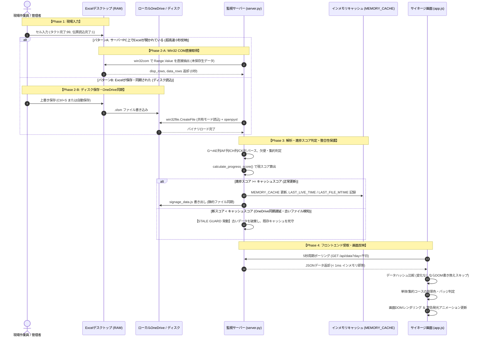

# 倉庫作業進捗サイネージシステム 要件定義書・システム基本仕様書

本書は、物流倉庫内における庫内作業（振出・査照・搬送）の進捗状況をリアルタイムで大型モニターおよび端末画面に可視化する「倉庫作業進捗サイネージシステム」の全構成、動作仕様、データパイプライン、条件分岐、例外処理、運用手順を体系的に整理・定義した基本仕様書である。

---

## 目次

1. [システム概要と目的](#1-システム概要と目的)
2. [システム全体アーキテクチャ](#2-システム全体アーキテクチャ)
3. [ファイル構成と各コンポーネントの役割](#3-ファイル構成と各コンポーネントの役割)
4. [データ連携フローおよびリアルタイム更新仕様（Excel更新から画面反映まで）](#4-データ連携フローおよびリアルタイム更新仕様excel更新から画面反映まで)
5. [Excelシート構造とデータマッピング仕様](#5-excelシート構造とデータマッピング仕様)
6. [進捗判定ロジックと画面表示条件分岐](#6-進捗判定ロジックと画面表示条件分岐)
7. [例外処理・整合性保護・フェイルセーフ設計](#7-例外処理整合性保護フェイルセーフ設計)
8. [フロントエンド機能仕様（UI/UX・自動制御）](#8-フロントエンド機能仕様uiux自動制御)
9. [外部連携仕様（Firebase Firestore / Web公開）](#9-外部連携仕様firebase-firestore--web公開)
10. [運用・保守・トラブルシューティング手順](#10-運用保守トラブルシューティング手順)

---

## 1. システム概要と目的

### 1.1 背景と課題
従来、物流倉庫内の出荷進捗やピッキング・検品状況は、現場PCで入力されるExcelファイル（「作業進捗管理データ.xlsm」）上で管理されていた。しかし、以下の課題が存在していた。
- **視認性の限界**: 現場作業員や管理者が進捗を把握するには、個別にPCを開いてExcelを確認する必要があり、全体の進捗が即座に共有されにくい。
- **リアルタイム性の欠如**: 手動でファイルを保存・再読み込みしなければ最新状態が画面に反映されない。
- **編集競合・ファイルロック**: 複数ユーザーによる同時閲覧や保存によるファイルロック（競合）が発生しやすい。

### 1.2 システムの目的
- 現場の担当者が日常業務で入力するExcelファイルの進捗データを、**人の操作を介さず完全自動で1〜2秒間隔で検知・解析**する。
- 倉庫内の大型サイネージモニターおよび作業員のPC・タブレット画面へ、**未着手・作業中・完了・配達なし**を直感的なカラータイルとしてリアルタイム投影する。
- 搬送完了時刻とのタイムラグを自動算出し、**早着・遅れ・10分前警告の発光アニメーション**によって現場の遅延を未然に防止する。

---

## 2. システム全体アーキテクチャ

システムは「現場入力レイヤー」「データ収集・中継サーバー（バックエンド）」「表示レイヤー（フロントエンド）」「外部クラウド配信レイヤー」の4層構造で構成される。

```
+-----------------------------------------------------------------------------------+
| 1. 現場入力レイヤー (現場PC群)                                                    |
|    - 各端末のExcelデスクトップアプリで「(曜日)作業進捗管理データ.xlsm」を編集     |
|    - 編集内容は Microsoft 365 クラウド (SharePoint / OneDrive) へ自動同期         |
+-----------------------------------------------------------------------------------+
                                         │
                                         ▼
+-----------------------------------------------------------------------------------+
| 2. データ収集・解析サーバー (server.py / ポート 8080)                             |
|    [優先検知①] 画面表示中Excel (Win32 COM / ActiveObject) ➡ 未保存生データを0秒取得 |
|    [優先検知②] OneDriveローカル同期ファイル ➡ 排他制御バイナリ読込 (CreateFile)     |
|    [安全装置]  進捗巻き戻り防止ガード (STALE GUARD) ➡ 古い同期遅延ファイルを破棄   |
|    [キャッシュ] 高速インメモリキャッシュ (MEMORY_CACHE) ➡ 応答速度 < 1ms          |
+-----------------------------------------------------------------------------------+
                   │                                         │
                   ▼ (HTTP API: 5秒ポーリング)                ▼ (HTTPS PATCH: 30秒同期)
+------------------------------------+   +------------------------------------------+
| 3. フロントエンド表示レイヤー     |   | 4. 外部クラウド配信レイヤー               |
|    (index.html / app.js)           |   |    (Firebase / Firestore Live Document)  |
|    - 大型サイネージモニター (Chrome) |   |    - 離れた事務所・外出先・スマホ閲覧用  |
|    - 自動等速スクロール / 時計表示 |   |    - Hosting URL: warehouse-work-        |
|    - タイル色・車両バッジの動的描画|   |      progress.web.app                    |
+------------------------------------+   +------------------------------------------+
```

---

## 3. ファイル構成と各コンポーネントの役割

### 3.1 ディレクトリ配置
本システムは、社内共有フォルダ（`X:\全社共有\371神奈川\全社ﾌｫﾙﾀﾞ\物流本部フォルダ\00_共有スペース\庫内ステータス管理\作業進捗状況システム\`）および実行PCのローカルリポジトリに展開されている。

```
作業進捗状況システム/
├── server.py                   # コアバックエンドサーバー (Python)
├── index.html                  # サイネージメインUI画面 (HTML5)
├── app.js                      # フロントエンドロジック (Vanilla JavaScript)
├── style.css                   # デザイン・タイポグラフィ・アニメーション (CSS3)
├── config.json                 # 動作環境設定ファイル
│
├── python_runtime/             # 依存関係ゼロ運用のためのポータブルPython環境
│   └── python.exe              # 専用実行ランタイム (Python 3.14)
│
├── start.bat                   # サーバー起動バッチ（ワンクリック実行）
├── サイネージ停止.bat          # サーバー完全停止・プロセス強制終了バッチ
├── サイネージ閲覧(見るだけ).url # 全社員用ショートカットURL (localhost:8080)
├── Windows起動時に自動実行するよう登録.bat # スタートアップ常駐バッチ
├── 自動実行の登録解除.bat      # スタートアップ解除バッチ
│
├── firebase.json               # Firebase Hosting設定
├── .firebaserc                 # Firebaseプロジェクトエイリアス設定
├── firebase_credentials.json   # Google Cloud サービスアカウント秘密鍵
└── deploy_firebase.py / .bat   # クラウドデプロイ用スクリプト
```

### 3.2 各ファイルの責務一覧

| ファイル名 | 責務・役割 |
| :--- | :--- |
| **`server.py`** | ・ポート8080でHTTPサーバーを起動し、API（`/api/data`, `/api/config`）を提供。<br>・Excelファイルの自動探索・排他制御バイナリ読み込み・Win32 COM連携。<br>・G〜AE列の解析と進捗ステータスへの変換。<br>・進捗巻き戻り防止ガード（STALE GUARD）による同期遅延ファイルの破棄。<br>・Firebase Firestoreへの差分クラウドアップロード。 |
| **`app.js`** | ・5秒間隔の自動ポーリングによる画面更新。<br>・現在時刻と各コースの搬送完了時刻に基づく早着／遅延／10分前警告のリアルタイム算出。<br>・スマートレンダリング（データに差分がある場合のみDOMを書き換え、チラつきを防止）。<br>・画面の自動等速縦スクロール（最上部／最下部での一時停止機能付き）。<br>・クリック操作による一時停止・再開トースト通知。 |
| **`index.html`** | ・ヘッダー部（デジタル時計、曜日切り替えタブ、凡例バッジ、同期ステータス、操作ボタン）。<br>・メインスクロールコンテナ（全70〜76コースのグリッド配置エリア）。<br>・設定変更モーダルダイアログ。 |
| **`style.css`** | ・超高コントラストなダークネイビー基調のカラーパレット。<br>・進捗タイルの色分け（白、グレー `#94A3B8`、青 `#0070C0`、黄緑 `#C6EFCE`）。<br>・完了時刻のネオングロー発光・警告アニメーション（パルス点滅）。 |
| **`config.json`** | ・曜日別Excelファイルパス、ポーリング間隔、スクロール速度、フォントスケール等の外部パラメータ。 |

---

## 4. データ連携フローおよびリアルタイム更新仕様（Excel更新から画面反映まで）

### 4.1 データ元の場所（原本・同期先・探索パス）
本システムがリアルタイムに読み込む進捗データは、現場の担当者が日常業務で更新するMicrosoft 365のExcelファイル（マクロ有効ブック `.xlsm`）である。

#### 1. マスター原本の保管場所（クラウド・SharePoint / Teams）
- **格納ルート**: Teamsチーム / SharePointサイトの共有ドキュメント
  `新体制移行の情報共有 - ★入力シート\`
- **曜日別ファイル原本一覧**:
  | 対象曜日 | クラウド格納サブフォルダ | 原本ファイル名 |
  | :--- | :--- | :--- |
  | **平日（水〜土）** | `平日(水～土)（本番用）\` | `(平日)作業進捗管理データ.xlsm` |
  | **月曜** | `月曜（本番用）\` | `(月)作業進捗管理データ.xlsm` |
  | **火曜** | `火曜（本番用）\` | `(火)作業進捗管理データ.xlsm` |
  | **日・祝** | `日祝（本番用）\` | `(日祝)作業進捗管理データ.xlsm` |

#### 2. 各PC環境におけるローカル同期場所（探索優先順位 Multi-Tier Fallback）
サーバープログラム（`server.py`）は、実行PCやログオンアカウントの違いを吸収し、常に最新の原本にアクセスできるよう以下の優先順位でファイルを自動探索・解決する。SharePoint共有ライブラリを各PCのOneDriveに「ショートカットとして追加」して運用しているため、**優先①・優先②ともに `Shortcuts` フォルダ配下が正規の同期パス**となる。

1. **優先①（専用サーバーPC `85371-butsuryupc` のShortcutsパス）**:
   - `C:\Users\85371-butsuryupc\OneDrive - トヨタモビリティパーツ株式会社\Shortcuts\新体制移行の情報共有 - ★入力シート\(曜日)（本番用）\(曜日)作業進捗管理データ.xlsm`
   - （予備フォールバック: Shortcutsを介さない直接パス）
2. **優先①-2（実行中ユーザーPCのShortcutsパス）**:
   - `C:\Users\{実行ユーザー}\OneDrive - トヨタモビリティパーツ株式会社\Shortcuts\新体制移行の情報共有 - ★入力シート\(曜日)（本番用）\(曜日)作業進捗管理データ.xlsm`
   - （例: ユーザー `00137184` などのローカルShortcuts環境、予備直接パス含む）
3. **優先②（`config.json` の `excel_paths` 指定パス）**:
   - `config.json` 内で明示された正規のShortcutsパス：
     `C:\Users\85371-butsuryupc\OneDrive - トヨタモビリティパーツ株式会社\Shortcuts\新体制移行の情報共有 - ★入力シート\(曜日)（本番用）\(曜日)作業進捗管理データ.xlsm`
4. **優先③（ローカルOneDrive自動再帰探索フォールバック）**:
   - 実行PCの全OneDriveルート配下（`Shortcuts` 含む）を最大3階層までスキャンし、「`作業進捗管理データ`」「`新体制`」を含み、かつ更新日時（`mtime`）が最も新しい正規ファイル（除外ワード: `コピー`, `テスト`, `パワポ表示用`, `~$`）を自動選定。


---

### 4.2 OneDrive以降のデータ行先と伝送方法（データルーティング仕様）

現場PCでExcelに入力され、Microsoft 365（SharePoint / OneDrive）に保存・同期された進捗データは、利用目的に応じて**以下の2大ルート（ハイブリッド構造）**でリアルタイム配信される。

> [!IMPORTANT]
> **【結論】Web・スマホ公開の主軸ルートは、まさに「OneDrive ➡ Firebase ➡ Firebase Hosting」です**
> 社外やスマホ、他拠点から閲覧するWebサイネージは、ご認識の通り **「OneDrive（Excel入力） ➡ サーバー自動解析 ➡ Firebase（Firestore DB） ➡ Firebase Hosting（公開Webアプリ）」** というクラウドパイプラインによって完全自動配信されます。
> 一方で、倉庫内の大型サイネージモニターは、インターネット回線の切断やクラウド側の障害時でも現場の作業を絶対に止めないよう、**「OneDrive ➡ ローカルサーバー（ポート8080） ➡ 構内大型モニター」** という閉域超高速ルートを併用しています。

```
【二大配信ルートの対比】

[ルートA: クラウドWeb配信（スマホ・外出先・別フロア・他拠点用）]
  現場Excel (OneDrive) ──► サーバー自動解析 ──► Firebase (Firestore DB) ──► Firebase Hosting Webアプリ
                                                                            (https://warehouse-work-progress.web.app)

[ルートB: 構内大型サイネージ（倉庫内モニター専用・完全閉域・0秒反映）]
  現場Excel (OneDrive) ──► サーバー (ポート8080) ──► 倉庫内大型モニター (Chrome)
                           (またはXドライブ共有)
```

#### 1. データルーティング全体マップ（OneDrive以降の配送経路）

```mermaid
flowchart TD
    subgraph OneDriveLayer ["クラウド ＆ ローカルOneDrive層"]
        OD["OneDrive同期済みExcel (.xlsm)<br/>(Shortcuts フォルダ配下)"]
        RAM["画面表示中Excelプロセス<br/>(Win32 COM / メモリRAM)"]
    end

    subgraph ServerLayer ["データ収集・中継サーバー (server.py)"]
        COMRead["【方法A】Win32 COM IPC通信<br/>(Visible==True時: 0秒直読)"]
        BinRead["【方法B】win32file API (共有モード)<br/>+ openpyxl (バイナリロード)"]
        Engine["データ解析・進捗スコア判定エンジン<br/>(STALE GUARD 安全弁)"]
        MemCache["【行先①】高速インメモリキャッシュ<br/>(MEMORY_CACHE: 応答 < 1ms)"]
    end

    subgraph DistributionLayer ["データ配信・永続化層"]
        API["【行先②】HTTP REST API エンドポイント<br/>(/api/data?day=... / ポート8080)"]
        StaticJS["【行先③】静的ファイル (signage_data.js)<br/>(Xドライブ共有 / ゼロ障害自立用)"]
        Firestore["【行先④】Google Firebase Firestore<br/>(signage/live_status クラウド同期)"]
    end

    subgraph ClientLayer ["表示・閲覧クライアント層"]
        BrowserSignage["【行先⑤】倉庫内サイネージ画面 (app.js)<br/>・5秒周期 HTTP fetch ポーリング<br/>・動的scriptタグ (フォールバック)<br/>・スマートレンダリング ＆ 背景色制御"]
        CloudWeb["【行先⑥】社外・スマホ閲覧用Webアプリ<br/>(Firebase Hosting 公開URL)"]
    end

    RAM -->|プロセス間メモリ参照| COMRead
    OD -->|ディスク排他バイナリ読込| BinRead
    COMRead --> Engine
    BinRead --> Engine
    Engine --> MemCache

    MemCache -->|内部メモリ参照| API
    MemCache -->|アトミックファイル書出| StaticJS
    MemCache -->|HTTPS PATCH (OAuth2)| Firestore

    API -->|HTTP GET (JSON)| BrowserSignage
    StaticJS -.->|動的script注入 (障害時)| BrowserSignage
    Firestore -->|Web SDK / REST| CloudWeb
```

#### 2. OneDrive以降のデータ行先・伝送方法・役割一覧

| No | データの行先（Destination） | 格納場所・接続先 | 伝送方法・プロトコル | データ形式 | 更新頻度 | 主な役割・フェイルセーフ |
| :---: | :--- | :--- | :--- | :--- | :--- | :--- |
| **1** | **サーバー内部メモリ**<br>（キャッシュ層） | `server.py` プロセス内<br>`MEMORY_CACHE` 辞書 | **① Win32 COM IPC**<br>（未保存RAM直読）<br>**② win32file API**<br>（共有バイナリ読込） | Python辞書型<br>（コース・タクト別） | 2秒周期 | ・現場のセル入力を0秒で即時検知。<br>・OneDrive同期遅延時の進捗巻き戻りを防止（STALE GUARD）。 |
| **2** | **ローカルWeb API**<br>（リアルタイム配信） | `http://localhost:8080`<br>`/api/data?day={曜日}` | **HTTP/1.1 GET**<br>（キャッシュ無効化ヘッダー付き） | JSON文字列<br>（UTF-8） | クライアント要求時<br>（即答 < 1ms） | ・ブラウザサイネージへの高速データ供給。<br>・レスポンスヘッダーでブラウザキャッシュを完全抑止。 |
| **3** | **サイネージ表示画面**<br>（ブラウザフロントエンド） | 各端末のブラウザ<br>`app.js`（DOM構造） | **非同期 fetch()**<br>（フォールバック時は動的script） | DOM要素<br>（HTMLテーブル・タイル） | 5秒周期<br>（時計警告は500ms） | ・データハッシュ比較による不要再描画防止。<br>・単体/集約コースの背景色・バッジ判定。<br>・10分前警告パルス点滅。 |
| **4** | **静的共有ファイル**<br>（ゼロ障害バックアップ） | `X:\全社共有\...\`<br>`signage_data.js` | **ファイルシステム直接書出**<br>（アトミック置換） | JavaScript変数<br>`window.__ALL_...` | データ更新時 | ・Webサーバーが停止した場合や `file://` 直接起動でもサイネージが止まらない完全自立動作。 |
| **5** | **クラウドデータベース**<br>（外部Web配信） | Google Cloud Firestore<br>`signage/live_status` | **HTTPS PATCH**<br>（OAuth2 Bearer Token認証） | Firestore REST<br>ドキュメントJSON | 30秒間隔<br>（差分検知時） | ・社外ネットワーク、スマートフォン、他拠点モニターからのリアルタイム閲覧を可能にする。 |

#### 3. 各行先への詳細伝送メカニズム

##### 行先①：サーバー内部メモリ（`server.py` の `MEMORY_CACHE`）
- **伝送方法A（Win32 COM プロセス間通信）**:
  サーバー稼働PC上でExcelが起動している場合、`win32com.client.GetActiveObject("Excel.Application")` を経由して、OSのプロセス間通信（IPC）によりExcelプロセスの仮想メモリから直接 `UsedRange.Value` を吸い上げる。ファイル保存やクラウド同期を待つことなく「0秒」でメモリキャッシュに格納される。
- **伝送方法B（Win32 API ファイルハンドル直接読込）**:
  Excelが起動していない場合、OneDriveローカルフォルダの `.xlsm` を Windows API `win32file.CreateFile`（共有モード: `FILE_SHARE_READ | FILE_SHARE_WRITE | FILE_SHARE_DELETE`）で開き、他プロセスの排他ロックをすり抜けてバイナリストリーム（`io.BytesIO`）としてロード。`openpyxl`（`data_only=True`）により数式計算結果を展開してメモリキャッシュに格納する。
- **データ保護（STALE GUARD）**:
  格納前に全コースの進捗点数（`ProgressScore`）を算出し、新スコアが既存スコアを下回る（同期遅延・古いファイルを検知）場合は格納を破棄して最新データを維持する。

##### 行先②：ローカルWebサーバーのHTTP REST API（`/api/data`）
- **伝送方法**:
  ポート `8080` でリッスンする `server.py` の `do_GET` ハンドラが、URLクエリパラメータ（例: `?day=平日`）に応じて `MEMORY_CACHE` から該当曜日のデータを抽出。
- **通信仕様**:
  - `Content-Type: application/json; charset=utf-8`
  - `Cache-Control: no-cache, no-store, must-revalidate`
  - `Access-Control-Allow-Origin: *`（CORS許可）
  - ディスクI/Oを伴わない純粋なインメモリ応答のため、レスポンス速度は **1ミリ秒未満（< 1ms）** を達成。

##### 行先③：サイネージ表示画面（クライアントブラウザ `app.js`）
- **伝送方法（5秒ポーリング）**:
  ブラウザ上の `app.js` が、`fetch('/api/data?day=' + encodeURIComponent(currentSelectedDay) + '&_t=' + Date.now())` を5秒間隔で非同期実行。
- **画面反映処理**:
  1. **ハッシュ照合**: 受信した全コースデータのMD5ハッシュが前回と同一ならDOM再描画をスキップ（オートスクロールの滑らかさを維持）。
  2. **条件分岐描画**:
     - **単体コース**: コース完了（CK=1）で全列完了色（`#E2E8F0`）。
     - **集約コース**: 未完了コースが1つでもある場合、左3列（日祝・平日・時間）は白背景・濃紺バッジを維持し、完了した個別コースの項目〜伝票列のみ `#E2E8F0`。全コース完了で一括完了色。
  3. **時計駆動アニメーション**: 500msごとのデジタル時計更新ループ内で、搬送完了時刻との差分をリアルタイム計算し、10分前・超過時のゴールドオレンジ警告（パルス点滅）を制御。

##### 行先④：静的共有ファイル（`signage_data.js`）
- **伝送方法**:
  データ更新時に、全曜日分のデータをまとめた静的JavaScriptファイルとしてファイルサーバー（Xドライブ）に書き出す。
- **ゼロ障害フォールバック**:
  万一 `server.py` が落ちた場合や、ユーザーがデスクトップのショートカットから `file:///` プロトコルでHTMLを開いた場合、`app.js` は自動的に `<script id="dynamic_signage_data_script" src="signage_data.js?_t=...">` を動的生成して読み込むため、Webサーバー不要で最新データが表示される。

##### 行先⑤：クラウドデータベース（Firebase Firestore）
- **伝送方法**:
  サービスアカウントキー（`firebase_credentials.json`）から Google OAuth2 Bearer Token を自動発行し、Google Cloud Firestore の REST API エンドポイントへ HTTPS PATCH で送信（30秒間隔または差分検知時）。
- **外部公開連携**:
  外部公開用Webサイネージ（Firebase Hosting）がこのFirestoreドキュメントを直接参照することで、社内LAN外のスマートフォンや別拠点のモニターでもリアルタイムに同一の進捗を閲覧できる。

---

### 4.3 全体データフロー（Excel更新 ➡ 画面反映エンドツーエンド）



---

### 4.4 サーバーによるデータ受取と更新検知の動作・条件分岐

サーバー（`server.py`）は、2秒周期（バックグラウンド監視ループおよびAPIリクエスト時）で以下の3段階パイプラインを実行する。

```mermaid
flowchart TD
    Start["データ更新リクエスト (2秒周期)"] --> CheckLive{"① 画面上にExcelが開かれているか？<br/>(Win32 COM: Visible == True)"}
    
    CheckLive -->|Yes| LiveRead["Live RAMからデータを直接抽出<br/>(未保存の編集内容も0秒で取得)"]
    LiveRead --> LiveSuccess{"抽出成功？<br/>(非編集中)"}
    LiveSuccess -->|Yes| ScoreCheckLive{"進捗スコア判定<br/>(スコアが後退していないか)"}
    ScoreCheckLive -->|合格| UpdateCacheLive["最新キャッシュを更新<br/>LAST_LIVE_TIME を記録"]
    ScoreCheckLive -->|不合格| KeepCache1["既存キャッシュを維持"]
    LiveSuccess -->|No (編集中ビジー)| CheckRecentLive{"直近60秒以内にLive取得実績あり？<br/>かつディスクmtime <= Live時刻？"}
    
    CheckLive -->|No| CheckRecentLive
    
    CheckRecentLive -->|Yes (未保存状態)| KeepCache2["ディスクの古いファイル読み込みを抑止<br/>既存キャッシュを維持"]
    CheckRecentLive -->|No (ディスク更新あり)| DiskRead["② ディスクからファイル読み込み<br/>(排他CreateFile + openpyxl)"]
    
    DiskRead --> StaleGuard{"進捗巻き戻り判定 (STALE GUARD)<br/>新スコア < キャッシュスコア？"}
    StaleGuard -->|Yes (同期前ファイル)| DropStale["古いファイルを破棄<br/>[STALE GUARD 抑止ログ出力]"]
    StaleGuard -->|No (正常前進)| UpdateCacheDisk["最新キャッシュを更新<br/>LAST_FILE_MTIME を記録"]
    
    UpdateCacheLive --> End["API応答 / Firestore同期 / signage_data.js出力"]
    UpdateCacheDisk --> End
    KeepCache1 --> End
    KeepCache2 --> End
    DropStale --> End
```

#### ①【最優先】画面上Live ExcelからのRAM読み取り（Win32 COM）
- **動作**:
  WindowsのCOMインターフェース（`win32com.client.GetObject` / `GetActiveObject("Excel.Application")`）を経由し、対象のブックが開かれているか探索。
- **条件分岐**:
  - `w.FullName` または `w.Name` が対象Excelと一致、かつ `xl.Visible == True` の場合：
    画面上で開かれているワークシートの `UsedRange.Value` をメモリから直接取得する。
- **メリット**:
  現場作業者がセルに「`99`」を入力した瞬間、**上書き保存ボタンを押す前（未保存状態）や、OneDriveのクラウド同期ラグ（通常数秒〜数十秒）を待たずに「0秒」でサイネージに反映**される。

#### ②【保護】セル編集中ロック耐性と未保存上書き抑止
- **条件分岐**:
  作業者がセルをダブルクリックして数値を打ち込んでいる最中（Enter確定前）は、ExcelプロセスがビジーとなりCOM呼び出しが拒絶される。
- **保護ロジック**:
  直近60秒以内にLiveデータを取得しており、かつディスクの更新日時（`mtime`）がLive取得時刻以前である場合、**「ディスクに残っている古い（未保存）ファイル」を読みに行くことを強制遮断し、最新のLiveキャッシュを保持**する。

#### ③【ディスク読込】排他制御バイナリ読み込み（win32file API ＆ openpyxl）
- **条件分岐**:
  画面上でExcelが開かれていない場合、ローカルディスク上の `.xlsm` を読み込む。
- **排他ロック回避（PermissionError防止）**:
  通常、他者がExcelファイルを開いている最中にPythonの `open()` を呼ぶと共有違反エラー（PermissionError）で停止する。
  本システムでは、Windows Win32 API の `win32file.CreateFile` を使用し、
  `FILE_SHARE_READ | FILE_SHARE_WRITE | FILE_SHARE_DELETE`
  の共有モードで安全にファイルハンドルを開いてバイナリ（`io.BytesIO`）に吸い上げ、`openpyxl`（`data_only=True`）でパースする。
- **タイムスタンプ照合**:
  `os.path.getmtime` が前回と同じで、かつキャッシュが存在する場合は、重いExcelパース処理をスキップして即座にキャッシュを返却する。

---

### 4.5 データ整合性保護ロジック（進捗スコア判定と同期遅延STALE GUARD）

クラウドストレージ（OneDrive / SharePoint）環境特有の課題として、**「ネットワークの遅延により、ローカルディスクに古い過去のファイルが一時的に復元・再同期されてしまう現象」** が存在する。これを放置すると、サイネージの進捗が一瞬巻き戻ってしまい現場が混乱する。

#### 1. 進捗スコア計算式（`calculate_progress_score`）
サーバーは、パースしたデータ全体の「進捗量」を以下の式で数値化する。

$$\text{ProgressScore} = \sum_{\text{全コース}} \left( \text{振出完了数} \times 1 + \text{査照完了数} \times 2 + (\text{伝票完了} \ ? \ 5 : 0) \right)$$

- 振出（ピッキング）完了タクト：1点
- 査照（検品）完了タクト：2点
- 伝票発行完了：5点

#### 2. STALE GUARD（巻き戻りブロック）の判定フロー
```
読み込んだ新データ の ProgressScore
  │
  ├─ >= 既存キャッシュの ProgressScore ──────► 【正常前進】キャッシュを最新データで更新
  │
  └─ <  既存キャッシュの ProgressScore ──────► 【同期遅延・古いファイルを検知】
                                                ・新データを破棄（破棄ログ出力）
                                                ・既存の最新キャッシュを死守
```
この二重安全弁により、いかなる通信遅延やファイル同期の逆転が発生しても、サイネージ上の進捗が後退することは絶対にない。

---

### 4.6 フロントエンド（画面 `app.js`）での受取・画面反映フロー

#### 1. 5秒周期のハイブリッドデータ受取
1. **第一優先（HTTP API）**:
   `fetch('/api/data?day=平日&_t=' + Date.now())` を実行（インメモリキャッシュからレスポンス < 1ms で即答）。
2. **第二優先（静的ファイル動的注入フォールバック）**:
   Webサーバーが万一ダウンしている場合や、ローカルファイル（`file://`）で起動されている場合、自動的に動的 `<script id="dynamic_signage_data_script">` を生成して `signage_data.js`（`window.__ALL_SIGNAGE_DATA__`）を読み込む。

#### 2. スマートレンダリング（データハッシュ比較）
取得した全コースデータのMD5/JSONハッシュを前回のハッシュと比較。
- **完全一致**: DOM再描画を行わず、滑らかな等速縦スクロール（35〜40px/秒）を一切阻害しない。
- **差分あり**: 新しい進捗状況に基づき、該当行・タイルのDOMのみを効率的に更新。

#### 3. 単体コース vs 集約コースの背景色・バッジ条件分岐
画面生成時、コース行ごとに以下の厳密な条件分岐を適用する。

- **単体コース（平日コースが1つのみ）**:
  - 当該コースが完了（CK列 = 1 または配送なし）した時点で、**日祝・平日・搬送完了時間・項目〜伝票の全列が一括で完了色（`#E2E8F0`）** に変化し、バッジもスレートグレー（`#64748B`）になる。
- **集約コース（平日コースが複数集約されている場合）**:
  - **1つでも未完了コースがある場合**:
    - **左3列（日祝コース・平日コース・搬送完了時間）**: 背景色は変更せず **白背景（`#FFFFFF`）** を維持し、バッジも **濃紺（`#0A2558`）** を維持。
    - **右側（項目〜伝票列）**: **完了した個別コースの行のみ先行して完了色（`#E2E8F0`）** に変化（未完了行は白維持）。
  - **配下の全コースが完了した場合**:
    - 左3列も含め、**全行・全列が一括で完了色（`#E2E8F0`）** に切り替わり、バッジも **スレートグレー（`#64748B`）** に変化する。

#### 4. 時間警告判定（毎秒2回 / 500ms時計駆動）
データ自体の更新とは独立して、画面上のデジタル時計更新（500ms周期）に合わせてリアルタイムで現在時刻と搬送予定時刻（`C列`）を比較評価。
- **未完了 かつ 残り10分以内 または 予定時刻超過**:
  - 時間テキストに `time-val-warning` クラスを動的付与（ゴールドオレンジ `#FF9900` の激しいネオン発光・パルス点滅を開始）。
- **完了済み**:
  - 警告は発動せず、完了実績時刻（CM列）および早着／遅延バッジ（CN列）を安定表示。

---

## 5. Excelシート構造とデータマッピング仕様

### 5.1 参照シート
対象Excelブック内の以下の2シートを読み取る。
- **「(曜日)表示」シート**: コース定義、車両名、搬送予定時刻のヘッダー情報を取得。
- **「(曜日)データ」シート**: 各コース・各便の振出および査照の実績ステータスを取得。

### 5.2 行構造（2行1ペア仕様）
各コースは、連続する2行で1つのコースを表す。
- **奇数行（上行）**: **振出（ピッキング・出庫作業）** の進捗。
- **偶数行（下行）**: **査照（検品・照合完了）** の進捗。

### 5.3 列定義と役割

| 列範囲 | 列インデックス (0始まり) | 列の名称・役割 | データの性質 |
| :--- | :--- | :--- | :--- |
| **C列** | 2 | **搬送完了予定時間** | `12:10:00` などの時刻文字列 |
| **E列** | 4 | **コース名称** | `04`, `FH`, `FJ`, `H2` などのコースコード |
| **G〜AE列** | 6 〜 30 | **進捗ステータス参照列（1タクト〜25タクト）** | 各タクトの進捗値（`0`: 未着手, `1`: 作業中, `99`: 完了） |
| **AF列** | 31 | **配送設定判定フラグ** | `99` または `TRUE`: 配送なし判定 |
| **CH列** | 85 | **伝票ステータス** | `1`: 伝票完了 |
| **CK列** | 88 | **コース完了ステータス** | `1`: コース全作業完了 |

---

## 6. 進捗判定ロジックと画面表示条件分岐

サイネージ画面における進捗表示は、Excelデータシートの **`G〜AE列`（1タクト〜25タクト）** から抽出されたステータス値、時刻情報、配送設定フラグに基づき、フロントエンド（`app.js`）およびバックエンド（`server.py`）が連携して厳密に条件分岐判定を行う。本節ではその判定ルールおよび視覚的出力の全仕様を定義する。

### 6.1 タクト進捗タイルのステータス判定マトリクス（1タクト〜25タクト）
コース内の「振出（奇数行）」および「査照（偶数行）」の各タクト（1〜25タクト）は、データシートの **`G〜AE列`（列インデックス 6〜30）** のセル値に従って以下のマトリクスによりスタイルが決定される。

| 優先度 | 判定条件（G〜AE列） | 適用CSSクラス | 背景色 / 枠線色 | 表示内容・文字色 | 現場における状態 |
| :---: | :--- | :--- | :--- | :--- | :--- |
| **1** | `is_no_delivery === true`<br>（配送なしコース） | `tile-green-nodelivery` | 背景: `#C6EFCE`<br>枠線: `#A8D5A2` | **タクト番号非表示**（空白） | 本コース・タクトの運行設定なし（欠便・荷物なし） |
| **2** | `status === 99`<br>（完了値：イコール99） | `tile-blue-done` | 背景: `#0070C0`<br>枠線: `#005999` | **タクト番号を表示**<br>文字色: `#FFFFFF` (白)<br>太字 (Bold) | **作業完了**（振出完了 または 査照完了） |
| **3** | `status === 1`<br>（作業中値：イコール1） | `tile-grey-active` | 背景: `#94A3B8`<br>枠線: `#64748B` | **タクト番号を表示**<br>文字色: `#FFFFFF` (白)<br>通常ウェイト | **作業中**（ピッキング着手中 または 照合中） |
| **4** | `status === 0` または `null` / 空白<br>（未着手値） | `tile-unstarted` | 背景: `#FFFFFF`<br>枠線: `#CBD5E1` (極薄グレー) | **タクト番号非表示**（空白） | **未着手**（まだ作業が開始されていない） |

```
【タクト進捗タイル表示フロー】
[対象タクトのデータ (G〜AE列: パワポ表示用変換)]
  │
  ├─ is_no_delivery == true ? ──────► 【薄黄緑タイル】(文字なし)
  │
  ├─ status == 99 ? ────────────────► 【鮮やか青タイル】(白文字でタクト番号)
  │
  ├─ status == 1 ? ─────────────────► 【グレータイル】(白文字でタクト番号)
  │
  └─ それ以外 (status == 0) ────────► 【白枠タイル】(文字なし・未着手)
```

> [!NOTE]
> **「パワポ表示用変換」列（G〜AE列）の計算仕様**:
> データシートのG〜AE列には、エンドカード（`99`）が打たれた際、その手前の着手タクト（`1`）をすべて一括で `99`（完了・青）に変換する数式（`=IFERROR(...)`）が組み込まれている。サイネージシステムはこの数式計算結果を忠実に反映するため、Excel画面上のデータシートと同様に、エンドカード到達タクトおよびそれ以前のタクトはすべて青（`99`）で描画される。

---

### 6.2 「配送なし（欠便）」の厳密判定条件
Excel内部でタクト自体が存在しない（運行がない）コースは、現場の誤解を防ぐために全タクトを「薄い黄緑色」で一括表示する。サーバー側（`server.py`）で以下の論理式により判定される。

```python
# 配送なし判定論理式 (server.py)
all_furidashi_zero = all(item["status"] == 0 for item in furidashi_items)
is_data_af_99 = (data_af_val in (99, "99", 99.0))
is_disp_af_true = (disp_af_val is True or str(disp_af_val).strip().upper() in ("TRUE", "1"))

is_no_delivery = (all_furidashi_zero and is_data_af_99) or is_disp_af_true
```

- **条件A（自動計算式検知）**:
  「振出の1〜25タクトのステータス（G〜AE列）がすべて `0`」かつ「データシートの **AF列（列32）の値が `99`**」
- **条件B（表示フラグ検知）**:
  「表示シートの **AF列（列32）の値が `TRUE` または `1`**」
- **適用結果**:
  - `is_no_delivery = true` となり、1〜25タクトの全タイルが薄黄緑（`#C6EFCE`）となる。
  - 伝票チェックボックスも薄黄緑枠（`slip-nodelivery-green`）となる。
  - 後述のコース完了判定（`is_completed`）も自動的に `true` となり、未完了警告の対象から除外される。


---

### 6.3 コース完了（`is_completed`）の判定条件
各コース行が「全作業完了」に達したかどうかの判定基準。

- **判定論理式**:
  `is_course_completed = (データシートCK列 == 1) or (is_no_delivery == true)`
  - **データシートCK列（インデックス88）**: Excel側で全タクトの査照完了を判定する計算セル。値が `1` のとき完了。
  - **配送なし**: 運行がないコースも未作業扱いとならないよう完了とみなす。
- **画面側の挙動**:
  - `is_course_completed === true` のコース行（`<tr>`）には `course-completed-row` クラスが付与される。
  - コース単位の搬送完了時刻セルに、完了実績および早着／遅延バッジが表示可能となる。

---

### 6.4 車両グループ（大枠バッジ）と行背景色の連動条件分岐
画面の行背景色およびバッジ色は、**単体コース（平日コースが1つ）**と**集約コース（平日コースが複数）**で厳密に異なる制御を行う。

```
【集約コースにおける背景色変化ルール】
配下の全コース (course[0] ... course[N-1])
  │
  ├─ 全コースの is_completed がすべて true ──► 【全列完了色 (#E2E8F0) ＆ スレートグレーバッジ (#64748B)】
  │                                            日祝コース・平日コース・搬送完了時間の背景も一括変更
  │
  └─ 1コースでも is_completed が false ──────► 【日祝コース・平日コース・搬送完了時間は白背景 (#FFFFFF) を維持】
                                               バッジも濃紺 (#0A2558) を維持
                                               ※ただし、完了した個別コースの「項目〜伝票列」のみ完了色 (#E2E8F0) に変化
```

> [!IMPORTANT]
> **集約コースにおける背景色変更の最重要ルール**
> 集約コースのうち、**1つでも完了していないコースがある場合、日祝コース・平日コース・搬送完了時間の背景色およびバッジ色は一切変更しない（白背景・濃紺バッジを維持）**。
> 一方で、完了した個別コースの「**項目〜伝票列（右側）」のみ先行して完了色（`#E2E8F0`）に変更**する。
> **配下のすべてのコースが完了した瞬間に初めて、日祝コース・平日コース・搬送完了時間も含めた全列の背景色およびバッジ色が完了色（スレートグレー／薄グレーブルー）に変更**される。

| コース種別 | 作業進捗状態 | 日祝コース / 平日コース / 搬送完了時間 | 項目 〜 伝票列（タクト・伝票） |
| :--- | :--- | :--- | :--- |
| **単体コース**<br>(平日コース1つ) | 未完了 | 白背景 / 濃紺バッジ (`#0A2558`) | 白背景 / 白枠または稼働中タイル |
| **単体コース**<br>(平日コース1つ) | 当該コース完了 | **完了色 (`#E2E8F0`) / スレートグレー (`#64748B`)** | **完了色 (`#E2E8F0`) / 完了タイル** |
| **集約コース**<br>(平日コース複数) | 配下の全コースが未完了 | 白背景 / 濃紺バッジ (`#0A2558`) | 白背景 / 白枠または稼働中タイル |
| **集約コース**<br>(平日コース複数) | **一部のコースのみ完了<br>（1つでも未完了コースあり）** | **白背景を維持 (`#FFFFFF`)<br>濃紺バッジを維持 (`#0A2558`)**<br>※未完了が残るため左3列は一切変更しない | **完了したコースの行のみ項目〜伝票列が完了色 (`#E2E8F0`) に変化**<br>（未完了コースの行は白背景維持） |
| **集約コース**<br>(平日コース複数) | **配下の全コースが完了** | **全コース完了により完了色 (`#E2E8F0`)<br>スレートグレー (`#64748B`) に一括変化** | **全行が完了色 (`#E2E8F0`)** |


---

### 6.5 搬送完了時刻と時間警告（10分前・早着・遅れ）の完全計算ロジック
本システムは、時計更新（毎秒2回 / 500ms）と連動して、搬送予定時刻と現在時刻をリアルタイム比較し、作業遅れを防止するための動的警告を発動する。

#### 1. 予定時間と現在時刻の差分計算式
$$\text{targetTotalMin} = \text{予定時} \times 60 + \text{予定分}$$
$$\text{currentTotalMin} = \text{現在時} \times 60 + \text{現在分}$$
$$\text{diffMinutes} = \text{targetTotalMin} - \text{currentTotalMin}$$

#### 2. 時間警告・実績バッジの全条件分岐マトリクス

```
[コースまたは車両グループの時間セル]
  │
  ├─ 【未完了時 (is_completed == false)】
  │    ├─ diffMinutes <= 10 ────────► [ケース1: 10分前警告] 黄色発光 ＋ パルス点滅
  │    └─ diffMinutes > 10  ────────► [ケース2: 通常表示] ゴールドネオングロー静止
  │
  └─ 【完了時 (is_completed == true)】
       ├─ 実績時間差 < 0 ───────────► [ケース3: 早着] 緑色2段ボックス「完了 HH:MM / -XX分 早着」
       ├─ 実績時間差 > 0 ───────────► [ケース4: 遅延] 赤色2段ボックス「完了 HH:MM / +XX分 遅延」
       └─ 実績時間差 == 0 ──────────► [ケース5: 定刻] 青色2段ボックス「完了 HH:MM / 定刻 (±0)」
```

| 分岐ケース | 発動条件 | 画面デザイン | スタイル詳細（CSS） | 意図・視覚効果 |
| :--- | :--- | :--- | :--- | :--- |
| **ケース1: 10分前警告**<br>（未完了・直前または遅延） | `!isCompleted && diffMinutes <= 10` |  **黄色パルス発光**<br>`time-val-warning` | 文字色: `#F59E0B`<br>発光: `text-shadow: 0 0 16px rgba(245,158,11,0.9)`<br>アニメーション: 1秒周期で明滅（パルス点滅） | 搬送予定時刻まで10分を切ったか、すでに時刻を超過している未完了コースを遠くからでも警告。 |
| **ケース2: 通常未着手・進行中** | `!isCompleted && diffMinutes > 10` | **ゴールドネオングロー** | 文字色: `#F59E0B`<br>発光: `text-shadow: 0 0 8px rgba(245,158,11,0.4)`<br>点滅なし（静止） | 予定時刻まで十分な余裕がある通常状態。 |
| **ケース3: 早着完了**<br>（2段ボックス表示） | `isCompleted && diffMin < 0` | **エメラルドグリーン枠**<br>`diff-box-early` | 枠線: `2px solid #10B981`<br>背景: `#ECFDF5`<br>文字色: `#059669`<br>表示: 上段「完了 HH:MM」/ 下段「`-XX分 早着`」 | 予定時刻よりも早く全タクトが仕上がった良好状態。 |
| **ケース4: 遅延完了**<br>（2段ボックス表示） | `isCompleted && diffMin > 0` | **ルビーレッド枠**<br>`diff-box-late` | 枠線: `2px solid #EF4444`<br>背景: `#FEF2F2`<br>文字色: `#DC2626`<br>表示: 上段「完了 HH:MM」/ 下段「`+XX分 遅延`」 | 予定時刻を超過して仕上がった遅延状態。要因分析の対象。 |
| **ケース5: 定刻完了**<br>（2段ボックス表示） | `isCompleted && diffMin === 0` | **ロイヤルブルー枠**<br>`diff-box-ontime` | 枠線: `2px solid #3B82F6`<br>背景: `#EFF6FF`<br>文字色: `#2563EB`<br>表示: 上段「完了 HH:MM」/ 下段「`定刻 (±0)`」 | 予定時刻ジャストに仕上がった正常状態。 |

---

### 6.6 伝票完了判定とトリガーの全メカニズム
各コースの右端（2行を統合した縦長セル）に配置される伝票チェックボックス（青色の `✔` チェックマーク）は、現場での伝票スキャン（バーコード読み取り）と連動して以下の流れで自動判定・点灯する。

#### 1. 伝票完了のトリガーフロー
```
現場で伝票をバーコードスキャン
  │
  ▼
Excelの「(曜日)伝票読込」シートのA列にコースキー（例: 12 04, 9 H2）が記録される
  │
  ▼
「(曜日)データ」シート CG列の数式で照合
  =IFERROR(VLOOKUP($CR3, '(曜日)伝票読込'!$A:$A, 1, 0), "")
  │
  ▼
「(曜日)データ」シート CH列（列86 / インデックス85）が判定
  =IF(CG3<>"", 1, 0)  ──► スキャン実績があれば値が「1」になる
  │
  ▼
見回り役プログラム（server.py）が検知
  data_r1[85] == 1 ──► is_slip_done = True
  │
  ▼
サイネージ画面（app.js）に描画
  右端セルに【青背景 ＋ 白チェックマーク「✔」】（slip-done-blue）を表示！
```

#### 2. 表示スタイルの条件分岐マトリクス

| 状態 | トリガー条件 | 画面スタイル (CSSクラス) | 視覚表現 | 現場における意味 |
| :--- | :--- | :--- | :--- | :--- |
| **伝票完了** | データシート **CH列（インデックス85）の値が `1`**<br>（＝伝票読込シートにスキャン実績あり） | `slip-done-blue` | 背景: `#0070C0` (鮮やか青)<br>中央に白文字「**`✔`**」 | 伝票の仕分け・照合スキャンが完了した状態。 |
| **未完了** | データシート **CH列の値が `0`** または空欄<br>（＝伝票読込シートに未スキャン） | `slip-pending-empty` | 背景: `#FFFFFF` (白)<br>枠線: `#CBD5E1` (薄グレー)<br>チェックマークなし | 伝票の作業がまだ完了していない状態。 |
| **配送なし** | `is_no_delivery === true` | `slip-nodelivery-green` | 背景: `#C6EFCE` (薄黄緑)<br>チェックマークなし | そもそも配送のないコースのため伝票対象外。 |

---

### 6.7 車両名・コース名の統合セル（レイアウト分岐）
車両名とコース名の文字列関係によって、視認性を最大化するようグリッドレイアウトが動的に切り替わる。

- **統合表示（`colspan="2"` / `badge-course-full`）**:
  - **条件**: 「車両名とコース名が完全に一致（例：車両名が『04』でコース名も『04』）」または「コース名が空欄・ハイフン（`-`）」の場合。
  - **表示**: 2列分を結合した幅広バッジに単一の名称を中央揃えで大きく描画。
- **並列表示（2列個別表示）**:
  - **条件**: 「車両名が『12号車①』でコース名が『FH』」のように、親車両と子コースが明確に分かれている場合。
  - **表示**: 左列に車両名バッジ（`badge-vehicle-tall` または `badge-vehicle-single`）、右列にコース名バッジ（`badge-course-sub`）を並べて描画。


## 7. 例外処理・整合性保護・フェイルセーフ設計

### 7.1 進捗巻き戻り防止ガード（STALE GUARD）
OneDriveのクラウド同期には数秒〜数十秒の通信遅延が不可避で発生する。同期前の過去のファイルがローカルに存在するときにサーバーがそれを読み込んで画面が過去の状態に戻ってしまう現象（チラつき・先祖返り）を、以下のスコアリングロジックによって完全に抑止する。

```python
def calculate_progress_score(data):
    """完了便に10点、作業中便に1点を付与して進捗度を数値化"""
    score = 0
    for course in data.get("courses", []):
        for typ in ["furidashi", "sasho"]:
            for item in course.get(typ, {}).get("items", []):
                if item.get("status") == 99:
                    score += 10
                elif item.get("status") == 1:
                    score += 1
    return score
```
- **判定ルール**: 
  - **進捗後退（通常時）**: 新たに読み込んだデータの `new_score` が、現在メモリに保持されているキャッシュの `cached_score` より小さい場合（`new_score < cached_score`）、それは「同期遅延によって古いファイルを拾った」と断定し、**読み込み結果を即座に破棄して現在の最新キャッシュを維持**する。
  - **一括リセット検知（QRデータ削除時）**: エクセルの「QRデータ削除ボタン」押下や朝の初期化によって全タクトがクリアされ、`new_score == 0`（または `new_score <= 10` かつ `cached_score >= 50`）となった場合は、同期遅延ではなく「意図的な一括リセット操作」と自動判定し、ガードを解除して画面を即座に初期状態（全便白枠）に更新する。

### 7.2 ポート競合および多重起動防止
- `server.py` は `ThreadingHTTPServer.allow_reuse_address = True` を設定。
- `サイネージ停止.bat` は、ポート8080をリッスンしているプロセス、および `server.py` を実行中のすべてのPythonプロセスを Windows API (`taskkill /F /T`) で強制終了し、ポートのゾンビ残存を確実に防止する。

### 7.3 通信途絶時の自動フォールバック
- フロントエンド（`app.js`）は、ローカルHTTPサーバー（`localhost:8080`）との通信が万が一失敗した場合、即座に画面をクラッシュさせず、以下の順で代替ソースへフォールバックする。
  1. `Firestore Live Document`（インターネット経由のクラウドアシスト）
  2. `signage_data.json`
  3. `signage_data.js`（静的スクリプト読み込み）

---

## 8. フロントエンド機能仕様（UI/UX・自動制御）

### 8.1 画面自動縦スクロール機能
- **等速スムーズスクロール**: 画面内に全76コースが収まらない場合、`requestAnimationFrame` を用いて設定速度（既定 40px/秒）で滑らかに下方向へ自動スクロール。
- **端点一時停止**: 最下部に到達した際は4秒間停止、最上部に巻き戻った際は2秒間停止し、作業員の視認性を確保。
- **画面クリックによる一時停止**: 画面内の任意の場所をクリックすると、スクロールが即座に停止し「⏸️ 一時停止中（マウスで自由にスクロール可・画面クリックで再開）」のトースト通知が表示される。再度クリックすると自動スクロールが再開。

### 8.2 曜日自動判定と手動切り替えタブ
- システム起動時、PCのシステム時計から当日の曜日（日・祝／月曜／火曜／平日）を自動判別し、該当曜日のシートを優先表示。
- ヘッダーの曜日タブ（「平日」「月曜」「火曜」「日・祝」）をクリックすることで、他曜日の進捗状況を手動で即座に切り替え閲覧可能。

### 8.3 設定変更モーダル（UIからの動的チューニング）
- 画面右上の「⚙ 設定」ボタンより、以下のパラメータを画面上で変更可能（`config.json` に即座に保存反映）。
  - 自動スクロール速度（px/秒）
  - ポーリング更新間隔（秒）
  - 最上部・最下部での停止時間（秒）
  - 全体フォントスケール（0.8倍 〜 1.5倍）

---

## 9. 外部連携仕様（Firebase Firestore / Web公開）

### 9.1 Firestore Cloud Sync エンジン
倉庫内のローカルネットワーク外（事務所の別フロアやスマートフォン、社外端末）からでも進捗を閲覧できるよう、`server.py` のバックグラウンドスレッドが最新キャッシュを Google Cloud / Firebase Firestore へ自動中継する。

- **プロジェクトID**: `warehouse-work-progress`
- **対象ドキュメント**: `projects/warehouse-work-progress/databases/(default)/documents/signage_data/live`
- **送信頻度**: 進捗データにハッシュ値の変化があった瞬間に即時送信。変化がない場合でも30秒に1回のハートビート送信。
- **認証方式**: サービスアカウント秘密鍵（`firebase_credentials.json`）による OAuth2 Bearer Token 認証（トークン自動更新対応）。

---

## 10. 運用・保守・トラブルシューティング手順

### 10.1 日常の起動・停止手順
- **起動手順**:
  `X:\全社共有\371神奈川\全社ﾌｫﾙﾀﾞ\物流本部フォルダ\00_共有スペース\庫内ステータス管理\作業進捗状況システム\start.bat` をダブルクリックして実行する。
- **停止手順**:
  同フォルダ内の `サイネージ停止.bat` を実行する。
- **閲覧手順**:
  各クライアントPCのデスクトップにある「`サイネージ閲覧(見るだけ).url`」をクリックする。

### 10.2 トラブルシューティング（FAQ）

#### Q1. 画面の更新が止まった・赤いアイコンが表示される
- **原因**: サーバープログラムが停止しているか、Excelファイル名・パスが変更された。
- **対処法**:
  1. `サイネージ停止.bat` を実行後、再度 `start.bat` を起動する。
  2. 画面右上の同期ステータスを確認し、赤色（読込エラー）の場合は、対象のExcelファイルが移動またはリネームされていないか確認する。

#### Q2. 入力したはずのデータが反映されない
- **原因**: 現場PCのOneDrive同期が一時的に「同期保留中」または一時停止になっている。
- **対処法**:
  1. 入力を行ったPCのタスクバー右下のOneDrive雲アイコンを確認し、「最新の状態です」になっているか確認する。
  2. Excelの「自動保存」がONになっているか確認する。

#### Q3. 画面の文字サイズやスクロール速度を変えたい
- **対処法**:
  画面右上の「⚙ 設定」をクリックし、スライダーで調整して「保存して適用」を押す。

---

## 11. 改訂履歴

| 版数 | 改訂日 | 改訂者 | 改訂内容 |
| :--- | :--- | :--- | :--- |
| **1.0** | 2026/09/01 | システム開発チーム | 初版作成（高速インメモリ・複数曜日対応・Firebase同期） |
| **1.1** | 2026/09/05 | システム開発チーム | 画面Excel直接取得（Win32 COM Live RAM）エンジンの追加 |
| **1.2** | 2026/09/06 | システム開発チーム | 進捗巻き戻り防止ガード（STALE GUARD）の実装、二大配信ルート体系化、要件定義書の全面体系化 |
| **1.3** | 2026/09/06 | システム開発チーム | タクト進捗参照列を「G〜AE列（列インデックス6〜30）」に統一修正し、システムおよび仕様書を完全同期 |
| **1.4** | 2026/09/08 | システム開発チーム | STALE GUARD（進捗巻き戻り防止）に一括リセット検知（QRデータ削除・朝の初期化対応）を追加し、データ消去時の画面初期化（白枠クリア）を自動反映可能に改修 |
